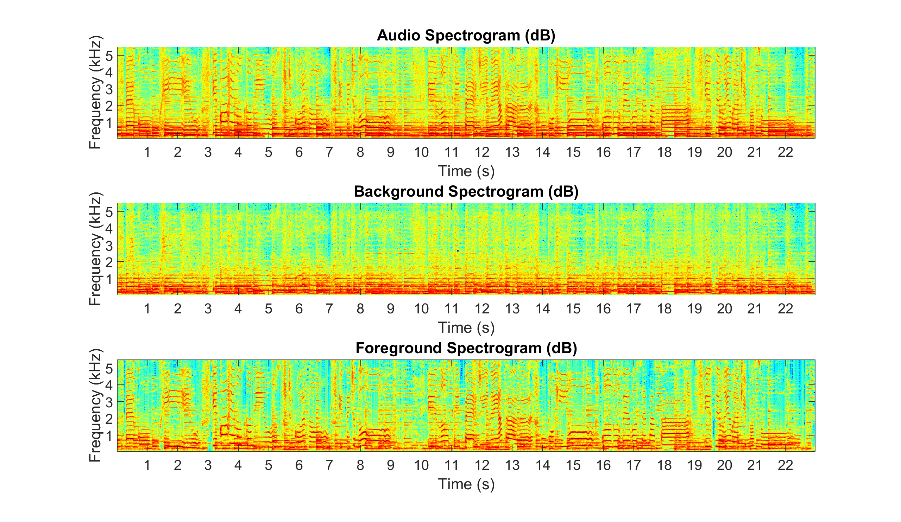
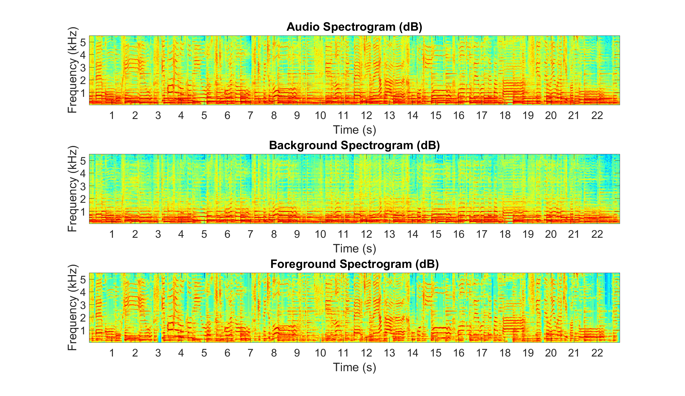

# REPET-Matlab

REPeating Pattern Extraction Technique (REPET) in **Matlab** for audio source separation.

Repetition is a fundamental element in generating and perceiving structure. In audio, mixtures are often composed of structures where a repeating background signal is superimposed with a varying foreground signal (e.g., a singer overlaying varying vocals on a repeating accompaniment or a varying speech signal mixed up with a repeating background noise). On this basis, we present the *REpeating Pattern Extraction Technique (REPET)*, a simple approach for separating the repeating background from the non-repeating foreground in an audio mixture. The basic idea is to find the repeating elements in the mixture, derive the underlying repeating models, and extract the repeating background by comparing the models to the mixture. Unlike other separation approaches, REPET does not depend on special parameterizations, does not rely on complex frameworks, and does not require external information. Because it is only based on repetition, it has the advantage of being simple, fast, blind, and therefore completely and easily automatable.

Files:
- [`repet.m`](#repet): Matlab class with the REPET methods.
- [`examples.ipynb`](#examplesipynb): Jupyter notebook with some examples.
- [`audio_file.wav`](#audio_filewav): audio file used for the examples.

See also:
- [REPET-Python](https://github.com/zafarrafii/REPET-Matlab): REPET in **Python** for audio source separation.

## repet.m

This Matlab class implements a number of methods for REPET:

Simply copy the file `repet.m` in your working directory and you are good to go.

Functions:
- [`original`](#original) - Compute the original REPET.
- [`extended`](#extended) - Compute REPET extended.
- [`adaptive`](#adaptive) - Compute the adaptive REPET.
- [`sim`](#sim) - Compute REPET-SIM.
- [`simonline`](#simonline) - Compute the online REPET-SIM.

Other:
- `sigplot` - Plot a signal in seconds.
- `specshow` - Display a spectrogram in dB, seconds, and Hz.

### original

Compute the original REPET.

```
background_signal = repet.original(audio_signal, sampling_frequency)
    
Inputs:
    audio_signal: audio signal (number_samples, number_channels)
    sampling_frequency: sampling frequency in Hz
Output:
    background_signal: audio STFT (window_length, number_frames)
```

#### Example: Estimate the background and foreground signals, and display their spectrograms.

```
% Read the audio signal and return the sample rate
[audio_signal,sample_rate] = audioread('audio_file.wav');

% Estimate the background signal and infer the foreground signal
background_signal = repet.original(audio_signal,sample_rate);
foreground_signal = audio_signal-background_signal;

% Write the background and foreground signals
audiowrite('background_signal.wav',background_signal,sample_rate)
audiowrite('foreground_signal.wav',foreground_signal,sample_rate)

% Compute the audio, background, and foreground spectrograms
window_length = 2^nextpow2(0.04*sample_rate);
window_function = hamming(window_length,'periodic');
step_length = window_length/2;
audio_spectrogram = abs(spectrogram(mean(audio_signal,2),window_function,window_length-step_length));
background_spectrogram = abs(spectrogram(mean(background_signal,2),window_function,window_length-step_length));
foreground_spectrogram = abs(spectrogram(mean(foreground_signal,2),window_function,window_length-step_length));

% Display the audio, background, and foreground spectrograms (up to 5kHz)
figure
subplot(3,1,1), imagesc(db(audio_spectrogram(2:window_length/8,:))), axis xy
title('Audio Spectrogram (dB)')
xticks(round((1:floor(length(audio_signal)/sample_rate))*sample_rate/step_length))
xticklabels(1:floor(length(audio_signal)/sample_rate)), xlabel('Time (s)')
yticks(round((1e3:1e3:sample_rate/8)/sample_rate*window_length))
yticklabels(1:sample_rate/8*1e-3), ylabel('Frequency (kHz)')
set(gca,'FontSize',30)
subplot(3,1,2), imagesc(db(background_spectrogram(2:window_length/8,:))), axis xy
title('Background Spectrogram (dB)')
xticks(round((1:floor(length(audio_signal)/sample_rate))*sample_rate/step_length))
xticklabels(1:floor(length(audio_signal)/sample_rate)), xlabel('Time (s)')
yticks(round((1e3:1e3:sample_rate/8)/sample_rate*window_length))
yticklabels(1:sample_rate/8*1e-3), ylabel('Frequency (kHz)')
set(gca,'FontSize',30)
subplot(3,1,3), imagesc(db(foreground_spectrogram(2:window_length/8,:))), axis xy
title('Foreground Spectrogram (dB)')
xticks(round((1:floor(length(audio_signal)/sample_rate))*sample_rate/step_length))
xticklabels(1:floor(length(audio_signal)/sample_rate)), xlabel('Time (s)')
yticks(round((1e3:1e3:sample_rate/8)/sample_rate*window_length))
yticklabels(1:sample_rate/8*1e-3), ylabel('Frequency (kHz)')
set(gca,'FontSize',30)
colormap(jet)
```


### extended

Compute REPET extended.

```
background_signal = repet.extended(audio_signal, sampling_frequency)
    
Inputs:
    audio_signal: audio signal (number_samples, number_channels)
    sampling_frequency: sampling frequency in Hz
Output:
    background_signal: audio STFT (window_length, number_frames)
```

#### Example: Estimate the background and foreground signals, and display their spectrograms.

```
% Read the audio signal and return the sample rate
[audio_signal,sample_rate] = audioread('audio_file.wav');

% Estimate the background signal and infer the foreground signal
background_signal = repet.extended(audio_signal,sample_rate);
foreground_signal = audio_signal-background_signal;

% Write the background and foreground signals
audiowrite('background_signal.wav',background_signal,sample_rate)
audiowrite('foreground_signal.wav',foreground_signal,sample_rate)

% Compute the audio, background, and foreground spectrograms
window_length = 2^nextpow2(0.04*sample_rate);
step_length = window_length/2;
window_function = hamming(window_length,'periodic');
audio_spectrogram = abs(spectrogram(mean(audio_signal,2),window_length,window_length-step_length));
background_spectrogram = abs(spectrogram(mean(background_signal,2),window_length,window_length-step_length));
foreground_spectrogram = abs(spectrogram(mean(foreground_signal,2),window_length,window_length-step_length));

% Display the audio, background, and foreground spectrograms (up to 5kHz)
figure
subplot(3,1,1), imagesc(db(audio_spectrogram(2:window_length/8,:))), axis xy
title('Audio Spectrogram (dB)')
xticks(round((1:floor(length(audio_signal)/sample_rate))*sample_rate/step_length))
xticklabels(1:floor(length(audio_signal)/sample_rate)), xlabel('Time (s)')
yticks(round((1e3:1e3:sample_rate/8)/sample_rate*window_length))
yticklabels(1:sample_rate/8*1e-3), ylabel('Frequency (kHz)')
set(gca,'FontSize',30)
subplot(3,1,2), imagesc(db(background_spectrogram(2:window_length/8,:))), axis xy
title('Background Spectrogram (dB)')
xticks(round((1:floor(length(audio_signal)/sample_rate))*sample_rate/step_length))
xticklabels(1:floor(length(audio_signal)/sample_rate)), xlabel('Time (s)')
yticks(round((1e3:1e3:sample_rate/8)/sample_rate*window_length))
yticklabels(1:sample_rate/8*1e-3), ylabel('Frequency (kHz)')
set(gca,'FontSize',30)
subplot(3,1,3), imagesc(db(foreground_spectrogram(2:window_length/8,:))), axis xy
title('Foreground Spectrogram (dB)')
xticks(round((1:floor(length(audio_signal)/sample_rate))*sample_rate/step_length))
xticklabels(1:floor(length(audio_signal)/sample_rate)), xlabel('Time (s)')
yticks(round((1e3:1e3:sample_rate/8)/sample_rate*window_length))
yticklabels(1:sample_rate/8*1e-3), ylabel('Frequency (kHz)')
set(gca,'FontSize',30)
colormap(jet)
```


### adaptive

Compute the adaptive REPET.

```
background_signal = repet.adaptive(audio_signal, sampling_frequency)
    
Inputs:
    audio_signal: audio signal (number_samples, number_channels)
    sampling_frequency: sampling frequency in Hz
Output:
    background_signal: audio STFT (window_length, number_frames)
```

#### Example: Estimate the background and foreground signals, and display their spectrograms.

```
% Read the audio signal and return the sample rate
[audio_signal,sample_rate] = audioread('audio_file.wav');

% Estimate the background signal and infer the foreground signal
background_signal = repet.adaptive(audio_signal,sample_rate);
foreground_signal = audio_signal-background_signal;

% Write the background and foreground signals
audiowrite('background_signal.wav',background_signal,sample_rate)
audiowrite('foreground_signal.wav',foreground_signal,sample_rate)

% Compute the audio, background, and foreground spectrograms
window_length = 2^nextpow2(0.04*sample_rate);
step_length = window_length/2;
window_function = hamming(window_length,'periodic');
audio_spectrogram = abs(spectrogram(mean(audio_signal,2),window_length,window_length-step_length));
background_spectrogram = abs(spectrogram(mean(background_signal,2),window_length,window_length-step_length));
foreground_spectrogram = abs(spectrogram(mean(foreground_signal,2),window_length,window_length-step_length));

% Display the audio, background, and foreground spectrograms (up to 5kHz)
figure
subplot(3,1,1), imagesc(db(audio_spectrogram(2:window_length/8,:))), axis xy
title('Audio Spectrogram (dB)')
xticks(round((1:floor(length(audio_signal)/sample_rate))*sample_rate/step_length))
xticklabels(1:floor(length(audio_signal)/sample_rate)), xlabel('Time (s)')
yticks(round((1e3:1e3:sample_rate/8)/sample_rate*window_length))
yticklabels(1:sample_rate/8*1e-3), ylabel('Frequency (kHz)')
set(gca,'FontSize',30)
subplot(3,1,2), imagesc(db(background_spectrogram(2:window_length/8,:))), axis xy
title('Background Spectrogram (dB)')
xticks(round((1:floor(length(audio_signal)/sample_rate))*sample_rate/step_length))
xticklabels(1:floor(length(audio_signal)/sample_rate)), xlabel('Time (s)')
yticks(round((1e3:1e3:sample_rate/8)/sample_rate*window_length))
yticklabels(1:sample_rate/8*1e-3), ylabel('Frequency (kHz)')
set(gca,'FontSize',30)
subplot(3,1,3), imagesc(db(foreground_spectrogram(2:window_length/8,:))), axis xy
title('Foreground Spectrogram (dB)')
xticks(round((1:floor(length(audio_signal)/sample_rate))*sample_rate/step_length))
xticklabels(1:floor(length(audio_signal)/sample_rate)), xlabel('Time (s)')
yticks(round((1e3:1e3:sample_rate/8)/sample_rate*window_length))
yticklabels(1:sample_rate/8*1e-3), ylabel('Frequency (kHz)')
set(gca,'FontSize',30)
colormap(jet)
```




### sim

Compute REPET-SIM.

```
background_signal = repet.sim(audio_signal, sampling_frequency)
    
Inputs:
    audio_signal: audio signal (number_samples, number_channels)
    sampling_frequency: sampling frequency in Hz
Output:
    background_signal: audio STFT (window_length, number_frames)
```

#### Example: Estimate the background and foreground signals, and display their spectrograms.

```
% Read the audio signal and return the sample rate
[audio_signal,sample_rate] = audioread('audio_file.wav');

% Estimate the background signal and infer the foreground signal
background_signal = repet.sim(audio_signal,sample_rate);
foreground_signal = audio_signal-background_signal;

% Write the background and foreground signals
audiowrite('background_signal.wav',background_signal,sample_rate)
audiowrite('foreground_signal.wav',foreground_signal,sample_rate)

% Compute the audio, background, and foreground spectrograms
window_length = 2^nextpow2(0.04*sample_rate);
step_length = window_length/2;
window_function = hamming(window_length,'periodic');
audio_spectrogram = abs(spectrogram(mean(audio_signal,2),window_length,window_length-step_length));
background_spectrogram = abs(spectrogram(mean(background_signal,2),window_length,window_length-step_length));
foreground_spectrogram = abs(spectrogram(mean(foreground_signal,2),window_length,window_length-step_length));

% Display the audio, background, and foreground spectrograms (up to 5kHz)
figure
subplot(3,1,1), imagesc(db(audio_spectrogram(2:window_length/8,:))), axis xy
title('Audio Spectrogram (dB)')
xticks(round((1:floor(length(audio_signal)/sample_rate))*sample_rate/step_length))
xticklabels(1:floor(length(audio_signal)/sample_rate)), xlabel('Time (s)')
yticks(round((1e3:1e3:sample_rate/8)/sample_rate*window_length))
yticklabels(1:sample_rate/8*1e-3), ylabel('Frequency (kHz)')
set(gca,'FontSize',30)
subplot(3,1,2), imagesc(db(background_spectrogram(2:window_length/8,:))), axis xy
title('Background Spectrogram (dB)')
xticks(round((1:floor(length(audio_signal)/sample_rate))*sample_rate/step_length))
xticklabels(1:floor(length(audio_signal)/sample_rate)), xlabel('Time (s)')
yticks(round((1e3:1e3:sample_rate/8)/sample_rate*window_length))
yticklabels(1:sample_rate/8*1e-3), ylabel('Frequency (kHz)')
set(gca,'FontSize',30)
subplot(3,1,3), imagesc(db(foreground_spectrogram(2:window_length/8,:))), axis xy
title('Foreground Spectrogram (dB)')
xticks(round((1:floor(length(audio_signal)/sample_rate))*sample_rate/step_length))
xticklabels(1:floor(length(audio_signal)/sample_rate)), xlabel('Time (s)')
yticks(round((1e3:1e3:sample_rate/8)/sample_rate*window_length))
yticklabels(1:sample_rate/8*1e-3), ylabel('Frequency (kHz)')
set(gca,'FontSize',30)
colormap(jet)
```




### simonline

Compute the online REPET-SIM.

```
background_signal = repet.simonline(audio_signal, sampling_frequency)
    
Inputs:
    audio_signal: audio signal (number_samples, number_channels)
    sampling_frequency: sampling frequency in Hz
Output:
    background_signal: audio STFT (window_length, number_frames)
```

#### Example: Estimate the background and foreground signals, and display their spectrograms.

```
% Read the audio signal and return the sample rate
[audio_signal,sample_rate] = audioread('audio_file.wav');

% Estimate the background signal and infer the foreground signal
background_signal = repet.simonline(audio_signal,sample_rate);
foreground_signal = audio_signal-background_signal;

% Write the background and foreground signals
audiowrite('background_signal.wav',background_signal,sample_rate)
audiowrite('foreground_signal.wav',foreground_signal,sample_rate)

% Compute the audio, background, and foreground spectrograms
window_length = 2^nextpow2(0.04*sample_rate);
step_length = window_length/2;
window_function = hamming(window_length,'periodic');
audio_spectrogram = abs(spectrogram(mean(audio_signal,2),window_length,window_length-step_length));
background_spectrogram = abs(spectrogram(mean(background_signal,2),window_length,window_length-step_length));
foreground_spectrogram = abs(spectrogram(mean(foreground_signal,2),window_length,window_length-step_length));

% Display the audio, background, and foreground spectrograms (up to 5kHz)
figure
subplot(3,1,1), imagesc(db(audio_spectrogram(2:window_length/8,:))), axis xy
title('Audio Spectrogram (dB)')
xticks(round((1:floor(length(audio_signal)/sample_rate))*sample_rate/step_length))
xticklabels(1:floor(length(audio_signal)/sample_rate)), xlabel('Time (s)')
yticks(round((1e3:1e3:sample_rate/8)/sample_rate*window_length))
yticklabels(1:sample_rate/8*1e-3), ylabel('Frequency (kHz)')
set(gca,'FontSize',30)
subplot(3,1,2), imagesc(db(background_spectrogram(2:window_length/8,:))), axis xy
title('Background Spectrogram (dB)')
xticks(round((1:floor(length(audio_signal)/sample_rate))*sample_rate/step_length))
xticklabels(1:floor(length(audio_signal)/sample_rate)), xlabel('Time (s)')
yticks(round((1e3:1e3:sample_rate/8)/sample_rate*window_length))
yticklabels(1:sample_rate/8*1e-3), ylabel('Frequency (kHz)')
set(gca,'FontSize',30)
subplot(3,1,3), imagesc(db(foreground_spectrogram(2:window_length/8,:))), axis xy
title('Foreground Spectrogram (dB)')
xticks(round((1:floor(length(audio_signal)/sample_rate))*sample_rate/step_length))
xticklabels(1:floor(length(audio_signal)/sample_rate)), xlabel('Time (s)')
yticks(round((1e3:1e3:sample_rate/8)/sample_rate*window_length))
yticklabels(1:sample_rate/8*1e-3), ylabel('Frequency (kHz)')
set(gca,'FontSize',30)
colormap(jet)
```


## audio_file.wav

23 second audio excerpt from the song *Que Pena Tanto Faz* performed by *Tamy*.


# References

- Bryan Pardo, Zafar Rafii, and Zhiyao Duan. "Audio Source Separation in a Musical Context," *Handbook of Systematic Musicology*, Springer, Berlin, Heidelberg, 2018. [[article](http://zafarrafii.com/Documents/Other/Pardo-Rafii-Duan%20-%20Audio%20Source%20Separation%20in%20a%20Musical%20Context%20-%202018.pdf)]

- Zafar Rafii, Antoine Liutkus, and Bryan Pardo. "REPET for Background/Foreground Separation in Audio," *Blind Source Separation*, Springer, Berlin, Heidelberg, 2014. [[article](http://zafarrafii.com/Documents/Other/Rafii-Liutkus-Pardo%20-%20REPET%20for%20Background-Foreground%20Separation%20in%20Audio%20-%202014.pdf)]

- Zafar Rafii and Bryan Pardo. "Online REPET-SIM for Real-time Speech Enhancement," *38th IEEE International Conference on Acoustics, Speech and Signal Processing*, Vancouver, BC, Canada, May 26-31, 2013. [[article](http://zafarrafii.com/Documents/Conferences/Rafii-Pardo%20-%20Online%20REPET-SIM%20for%20Real-time%20Speech%20Enhancement%20-%202013.pdf)][[poster](http://zafarrafii.com/Documents/Conferences/Rafii-Pardo%20-%20Online%20REPET-SIM%20for%20Real-time%20Speech%20Enhancement%20-%202013%20(poster).pdf)]

- Zafar Rafii and Bryan Pardo. "Audio Separation System and Method," 13612413, March 2013. [[URL](http://www.freepatentsonline.com/y2013/0064379.html)]

- Zafar Rafii and Bryan Pardo. "REpeating Pattern Extraction Technique (REPET): A Simple Method for Music/Voice Separation," *IEEE Transactions on Audio, Speech, and Language Processing*, vol. 21, no. 1, January 2013. [[article](http://zafarrafii.com/Documents/Journals/Rafii-Pardo%20-%20REpeating%20Pattern%20Extraction%20Technique%20(REPET)%20A%20Simple%20Method%20for%20Music-Voice%20Separation%20-%202013.pdf)]

- Zafar Rafii and Bryan Pardo. "Music/Voice Separation using the Similarity Matrix," *13th International Society on Music Information Retrieval*, Porto, Portugal, October 8-12, 2012. [[article](http://zafarrafii.com/Documents/Conferences/Rafii-Pardo%20-%20Music-Voice%20Separation%20using%20the%20Similarity%20Matrix%20-%202012.pdf)][[slides](http://zafarrafii.com/Documents/Conferences/Rafii-Pardo%20-%20Music-Voice%20Separation%20using%20the%20Similarity%20Matrix%20-%202012%20(slides).pdf)]

- Antoine Liutkus, Zafar Rafii, Roland Badeau, Bryan Pardo, and Gaël Richard. "Adaptive Filtering for Music/Voice Separation Exploiting the Repeating Musical Structure," *37th IEEE International Conference on Acoustics, Speech and Signal Processing*, Kyoto, Japan, March 25-30, 2012. [[article](http://zafarrafii.com/Documents/Conferences/Liutkus-Rafii-Badeau-Pardo-Richard%20-%20Adaptive%20Filtering%20for%20Music-Voice%20Separation%20Exploiting%20the%20Repeating%20Musical%20Structure%20-%202012.pdf)][[slides](http://zafarrafii.com/Documents/Conferences/Liutkus-Rafii-Badeau-Pardo-Richard%20-%20Adaptive%20Filtering%20for%20Music-Voice%20Separation%20Exploiting%20the%20Repeating%20Musical%20Structure%20-%202012%20(slides).pdf)]

- Zafar Rafii and Bryan Pardo. "A Simple Music/Voice Separation Method based on the Extraction of the Repeating Musical Structure," *36th IEEE International Conference on Acoustics, Speech and Signal Processing*, Prague, Czech Republic, May 22-27, 2011. [[article](http://zafarrafii.com/Documents/Conferences/Rafii-Pardo%20-%20A%20Simple%20Music-Voice%20Separation%20Method%20based%20on%20the%20Extraction%20of%20the%20Repeating%20Musical%20Structure%20-%202011.pdf)][[poster](http://zafarrafii.com/Documents/Conferences/Rafii-Pardo%20-%20A%20Simple%20Music-Voice%20Separation%20Method%20based%20on%20the%20Extraction%20of%20the%20Repeating%20Musical%20Structure%20-%202011%20(poster).pdf)]


# Author

- Zafar Rafii
- zafarrafii@gmail.com
- http://zafarrafii.com/
- [CV](http://zafarrafii.com/Zafar%20Rafii%20-%20C.V..pdf)
- [GitHub](https://github.com/zafarrafii)
- [LinkedIn](https://www.linkedin.com/in/zafarrafii/)
- [Google Scholar](https://scholar.google.com/citations?user=8wbS2EsAAAAJ&hl=en)
