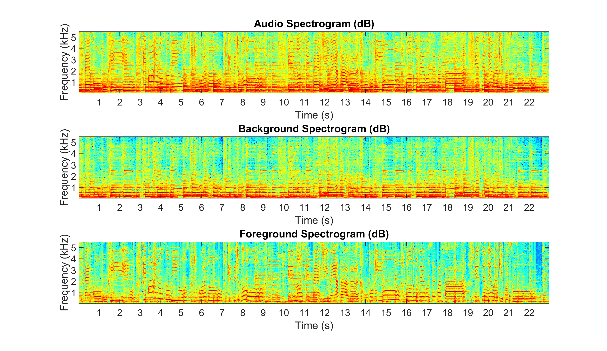

# REpeating Pattern Extraction Technique (REPET)

This repository includes a Matlab class and a Python module which implement a number of methods/functions for the different algorithms of the REpeating Pattern Extraction Technique (REPET), and Matlab GUIs to demo the original REPET, REPET-SIM, and uREPET.

- [repet Matlab class](#repet-matlab-class)
- [repet_demo_gui Matlab GUI](#repet_demo_gui-matlab-gui)
- [repet_sim_demo_gui Matlab GUI](#repet_sim_demo_gui-matlab-gui)
- [urepet Matlab GUI](#urepet-matlab-gui)
- [repet Python module](#repet-python-module)
- [References](#references)
- [Author](#author)

## repet Matlab class


Repetition is a fundamental element in generating and perceiving structure. In audio, mixtures are often composed of structures where a repeating background signal is superimposed with a varying foreground signal (e.g., a singer overlaying varying vocals on a repeating accompaniment or a varying speech signal mixed up with a repeating background noise). On this basis, we present the REpeating Pattern Extraction Technique (REPET), a simple approach for separating the repeating background from the non-repeating foreground in an audio mixture. The basic idea is to find the repeating elements in the mixture, derive the underlying repeating models, and extract the repeating  background by comparing the models to the mixture. Unlike other separation approaches, REPET does not depend on special parameterizations, does not rely on complex frameworks, and does not require external information. Because it is only based on repetition, it has the advantage of being simple, fast, blind, and therefore completely and easily automatable.

repet Methods:
- [original - REPET (original)](#repet-original)
- [extended - REPET extended](#repet-extended)
- [adaptive - Adaptive REPET](#adaptive-repet)
- [sim - REPET-SIM](#repet-sim)
- [simonline - Online REPET-SIM](#online-repet-sim)

### REPET (original)


The original REPET aims at identifying and extracting the repeating patterns in an audio mixture, by estimating a period of the underlying repeating structure and modeling a segment of the periodically repeating background.

`audio_stft = z.stft(audio_signal,window_function,step_length);`

Arguments:
```
audio_signal: audio signal [number_samples,number_channels]
sample_rate: sample rate in Hz
background_signal: background signal [number_samples,number_channels]
```

Example: Estimate the background and foreground signals, and display their spectrograms
```
% Read the audio signal and return the sample rate
[audio_signal,sample_rate] = audioread('audio_file.wav');

% Estimate the background signal and infer the foreground signal
background_signal = repet.original(audio_signal,sample_rate);
foreground_signal = audio_signal-background_signal;

% Compute the audio, background, and foreground spectrograms
window_length = 2^nextpow2(0.04*sample_rate);
step_length = window_length/2;
window_function = hanning(window_length,'periodic');
audio_spectrogram = abs(spectrogram(mean(audio_signal,2),window_length,window_length-step_length));
background_spectrogram = abs(spectrogram(mean(background_signal,2),window_length,window_length-step_length));
foreground_spectrogram = abs(spectrogram(mean(foreground_signal,2),window_length,window_length-step_length));

% Display the audio, background, and foreground spectrograms (up to 5kHz)
figure
subplot(3,1,1), imagesc(db(audio_spectrogram(2:window_length/8,:))), axis xy
title('Audio Spectrogram (dB)')
xticks(round((1:floor(length(audio_signal)/sample_rate))*sample_rate/step_length))
xticklabels(1:floor(length(audio_signal)/sample_rate)), xlabel('Time (s)')
yticks(round((1e3:1e3:sample_rate/8)/sample_rate*window_length))
yticklabels(1:sample_rate/8*1e-3), ylabel('Frequency (kHz)')
set(gca,'FontSize',30)
subplot(3,1,2), imagesc(db(background_spectrogram(2:window_length/8,:))), axis xy
title('Background Spectrogram (dB)')
xticks(round((1:floor(length(audio_signal)/sample_rate))*sample_rate/step_length))
xticklabels(1:floor(length(audio_signal)/sample_rate)), xlabel('Time (s)')
yticks(round((1e3:1e3:sample_rate/8)/sample_rate*window_length))
yticklabels(1:sample_rate/8*1e-3), ylabel('Frequency (kHz)')
set(gca,'FontSize',30)
subplot(3,1,3), imagesc(db(foreground_spectrogram(2:window_length/8,:))), axis xy
title('Foreground Spectrogram (dB)')
xticks(round((1:floor(length(audio_signal)/sample_rate))*sample_rate/step_length))
xticklabels(1:floor(length(audio_signal)/sample_rate)), xlabel('Time (s)')
yticks(round((1e3:1e3:sample_rate/8)/sample_rate*window_length))
yticklabels(1:sample_rate/8*1e-3), ylabel('Frequency (kHz)')
set(gca,'FontSize',30)
colormap(jet)
```



### REPET extended

The original REPET can be easily extended to handle varying repeating structures, by simply applying the method along time, on individual segments or via a sliding window.

`background_signal = repet.extended(audio_signal,sample_rate);`

### Adaptive REPET


The original REPET works well when the repeating background is relatively stable (e.g., a verse or the chorus in a song); however, the repeating background can also vary over time (e.g., a verse followed by the chorus in the song). The adaptive REPET is an extension of the original repet that can handle varying repeating structures, by estimating the time-varying repeating periods and extracting the repeating background locally, without the need for segmentation or windowing.

`background_signal = repet.adaptive(audio_signal,sample_rate);`


* Mixture [[audio](http://zafarrafii.com/Audio/dev2__another_dreamer-the_ones_we_love__snip_69_94__mix.wav)]
* Estimated foreground [[audio](http://zafarrafii.com/Audio/dev2__another_dreamer-the_ones_we_love__snip_69_94__foreground.wav)]
* Estimated background [[audio](http://zafarrafii.com/Audio/dev2__another_dreamer-the_ones_we_love__snip_69_94__background.wav)]
* Original vocals [[audio](http://zafarrafii.com/Audio/dev2__another_dreamer-the_ones_we_love__snip_69_94__vocals.wav)]
* Original accompaniment [[audio](http://zafarrafii.com/Audio/dev2__another_dreamer-the_ones_we_love__snip_69_94__mix-vocals.wav)]

### REPET-SIM


The REPET methods work well when the repeating background has periodically repeating patterns (e.g., jackhammer noise); however, the repeating patterns can also happen intermittently or without a global or local periodicity (e.g., frogs by a pond). REPET-SIM is a generalization of repet that can also handle non-periodically repeating structures, by using a similarity matrix to identify the repeating elements.

`background_signal = repet.sim(audio_signal,sample_rate);`


* Mixture [[audio](http://zafarrafii.com/Audio/dev_Sq1_Co_B_mix.wav)]
* Estimated foreground [[audio](http://zafarrafii.com/Audio/dev_Sq1_Co_B_mix_foreground.wav)]
* Estimated background [[audio](http://zafarrafii.com/Audio/dev_Sq1_Co_B_mix_background.wav)]
* Original speech [[audio](http://zafarrafii.com/Audio/dev_Sq1_Co_B_sim.wav)]
* Original noise [[audio](http://zafarrafii.com/Audio/dev_Sq1_Co_B_noi.wav)]

### Online REPET-SIM

REPET-SIM can be easily implemented online to handle real-time computing, particularly for real-time speech enhancement. The online REPET-SIM simply processes the time frames of the mixture one after the other given a buffer that temporally stores past frames.

`background_signal = repet.simonline(audio_signal,sample_rate);`

## repet_demo_gui Matlab GUI

Coming soon...

## repet_sim_demo_gui Matlab GUI

Coming soon...

## urepet Matlab GUI

Coming soon...

## repet Python module

Working on it...

## References

- Zafar Rafii, Antoine Liutkus, and Bryan Pardo. "A Simple User Interface System for Recovering Patterns Repeating in Time and Frequency in Mixtures of Sounds," *40th IEEE International Conference on Acoustics, Speech and Signal Processing*, Brisbane, Australia, April 19-24, 2015. [[article](http://zafarrafii.com/Publications/Rafii-Liutkus-Pardo%20-%20A%20Simple%20User%20Interface%20System%20for%20Recovering%20Patterns%20Repeating%20in%20Time%20and%20Frequency%20in%20Mixtures%20of%20Sounds%20-%202015.pdf)][[poster](http://zafarrafii.com/Publications/Rafii-Liutkus-Pardo%20-%20A%20Simple%20User%20Interface%20System%20for%20Recovering%20Patterns%20Repeating%20in%20Time%20and%20Frequency%20in%20Mixtures%20of%20Sounds%20-%202015%20(poster).pdf)]

- Zafar Rafii, Antoine Liutkus, and Bryan Pardo. "REPET for Background/Foreground Separation in Audio," *Blind Source Separation*, Springer, Berlin, Heidelberg, 2014. [[article](http://zafarrafii.com/Publications/Rafii-Liutkus-Pardo%20-%20REPET%20for%20Background-Foreground%20Separation%20in%20Audio%20-%202014.pdf)]

- Zafar Rafii and Bryan Pardo. "Online REPET-SIM for Real-time Speech Enhancement," *38th International Conference on Acoustics, Speech and Signal Processing*, Vancouver, BC, Canada, May 26-31, 2013. [[article](http://zafarrafii.com/Publications/Rafii-Pardo%20-%20Online%20REPET-SIM%20for%20Real-time%20Speech%20Enhancement%20-%202013.pdf)][[poster](http://zafarrafii.com/Publications/Rafii-Pardo%20-%20Online%20REPET-SIM%20for%20Real-time%20Speech%20Enhancement%20-%202013%20(poster).pdf)]

- Zafar Rafii and Bryan Pardo. "Audio Separation System and Method," US20130064379 A1, US 13/612,413, March 14, 2013. [[URL](https://www.google.com/patents/US20130064379)]

- Zafar Rafii and Bryan Pardo. "REpeating Pattern Extraction Technique (REPET): A Simple Method for Music/Voice Separation," *IEEE Transactions on Audio, Speech, and Language Processing*, vol. 21, no. 1, January 2013. [[article](http://zafarrafii.com/Publications/Rafii-Pardo%20-%20REpeating%20Pattern%20Extraction%20Technique%20(REPET)%20A%20Simple%20Method%20for%20Music-Voice%20Separation%20-%202013.pdf)]

- Zafar Rafii and Bryan Pardo. "Music/Voice Separation using the Similarity Matrix," *13th International Society on Music Information Retrieval*, Porto, Portugal, October 8-12, 2012. [[article](http://zafarrafii.com/Publications/Rafii-Pardo%20-%20Music-Voice%20Separation%20using%20the%20Similarity%20Matrix%20-%202012.pdf)][[slides](http://zafarrafii.com/Publications/Rafii-Pardo%20-%20Music-Voice%20Separation%20using%20the%20Similarity%20Matrix%20-%202012%20(slides).pdf)]

- Antoine Liutkus, Zafar Rafii, Roland Badeau, Bryan Pardo, and Gaël Richard. "Adaptive Filtering for Music/Voice Separation Exploiting the Repeating Musical Structure," *37th International Conference on Acoustics, Speech and Signal Processing*, Kyoto, Japan, March 25-30, 2012. [[article](http://zafarrafii.com/Publications/Liutkus-Rafii-Badeau-Pardo-Richard%20-%20Adaptive%20Filtering%20for%20Music-Voice%20Separation%20Exploiting%20the%20Repeating%20Musical%20Structure%20-%202012.pdf)][[slides](http://zafarrafii.com/Publications/Liutkus-Rafii-Badeau-Pardo-Richard%20-%20Adaptive%20Filtering%20for%20Music-Voice%20Separation%20Exploiting%20the%20Repeating%20Musical%20Structure%20-%202012%20(slides).pdf)]

- Zafar Rafii and Bryan Pardo. "A Simple Music/Voice Separation Method based on the Extraction of the Repeating Musical Structure," *36th International Conference on Acoustics, Speech and Signal Processing*, Prague, Czech Republic, May 22-27, 2011. [[article](http://zafarrafii.com/Publications/Rafii-Pardo%20-%20A%20Simple%20Music-Voice%20Separation%20Method%20based%20on%20the%20Extraction%20of%20the%20Repeating%20Musical%20Structure%20-%202011.pdf)][[poster](http://zafarrafii.com/Publications/Rafii-Pardo%20-%20A%20Simple%20Music-Voice%20Separation%20Method%20based%20on%20the%20Extraction%20of%20the%20Repeating%20Musical%20Structure%20-%202011%20(poster).pdf)]

# Author

- Zafar Rafii
- zafarrafii@gmail.com
- [Website](http://zafarrafii.com/)
- [CV](http://zafarrafii.com/Zafar%20Rafii%20-%20C.V..pdf)
- [Google Scholar](https://scholar.google.com/citations?user=8wbS2EsAAAAJ&hl=en)
- [LinkedIn](https://www.linkedin.com/in/zafarrafii/)
